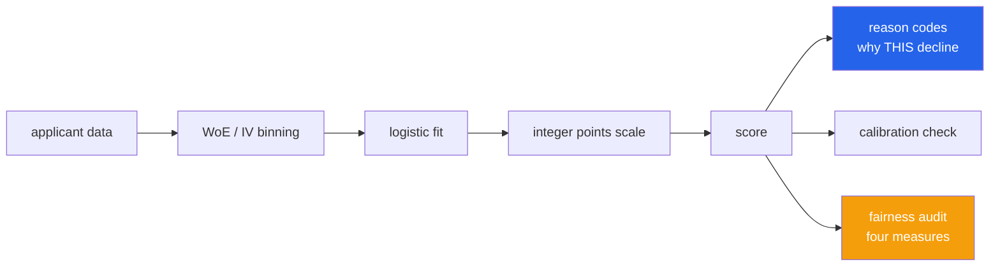

<h1 align="center">credit-risk-engine (Python · WoE/IV binning · logistic scorecard)</h1>
<p align="center"><i>A credit scorecard that can explain every decline, in points, to a regulator</i></p>

<p align="center">
  <a href="#quickstart">Quickstart</a> &middot;
  <a href="#command-line">CLI</a> &middot;
  <a href="#why-scorecards-when-gradient-boosting-scores-better">Why scorecards</a> &middot;
  <a href="#weight-of-evidence">Weight of Evidence</a> &middot;
  <a href="#the-points-scale">The points scale</a> &middot;
  <a href="#calibration-not-just-discrimination">Calibration</a> &middot;
  <a href="#fairness-four-measures-because-they-are-incompatible">Fairness</a> 
</p>

<p align="center">
  <a href="https://github.com/hammasbuilds/credit-risk-engine/actions/workflows/ci.yml"></a>
  
  
  
  <a href="LICENSE"></a>
</p>

---

## Quickstart

```bash
git clone https://github.com/hammasbuilds/credit-risk-engine
cd credit-risk-engine
python -m venv .venv
source .venv/bin/activate      # Windows: .venv\Scripts\activate
pip install -e ".[dev]"        # the package has zero dependencies; [dev] adds pytest + ruff
python demo.py
pytest -q                      # 108 tests
```

`uv sync` works too and reads the same `dev` group.

One call fits a whole card. `columns` is a dict of lists, or `{c: df[c] for c in cols}`
from pandas. Text columns are binned by category and the rest by quantile. `None`,
`NaN`, `pandas.NA` and blank strings all count as missing.

```python
from creditrisk import audit, fit_scorecard, synthetic

data = synthetic()  # 2,000 synthetic loans where the truth is known; use your own columns
card = fit_scorecard(
    {"income": data["income"], "age": data["age"], "employment": data["employment"]},
    data["default"],  # 1 = defaulted, 0 = repaid
)

income = card.features["income"]
print(income.iv, income.strength(), income.is_monotonic())  # 0.396605 strong True

applicant = {"income": 34.0, "age": 29, "employment": "self-employed"}
print(card.score(applicant))            # 487
print(card.probability(applicant))      # 0.501065
print(card.reason_codes(applicant)[0])  # {'feature': 'income', 'bin': '[-inf, 54.2)', 'points': 148, 'points_lost': 52}

# A blank field gets the neutral (population-average) points, not zero.
print(card.score({"income": 34.0, "employment": "self-employed"}))  # 487

# Fairness audit of the decisions at a cut-off of 527 (P(default) = 20%).
rows = [{k: data[k][i] for k in ("income", "age", "employment")} for i in range(2000)]
approved = [int(card.score(r) >= 527) for r in rows]
report = audit(data["employment"], approved, data["default"])
print(report["worst_disparate_impact"], report["four_fifths_rule_flag"])  # 0.631053 True
```

Every number in those comments is what the code prints. `tests/test_readme.py` runs
the block and checks each one.

The audit groups by employment type because the synthetic book has no protected
attribute. The flag fires, and `bad_rate_difference` (+0.093 for self-employed) sits
next to it so the reader can judge how much of the gap real risk explains.

Keeping the card:

```python
from creditrisk import Scorecard

card.save("card.json")                # plain JSON: bins, WoE, coefficients, points
card = Scorecard.load("card.json")    # scores identically; a hand-edited points table is refused
card.points_table()                   # feature / bin / n / bad rate / WoE / points
card.explain(applicant, cutoff=527)   # score, P(default), points, reasons, decision as one dict
```

You can still go step by step (`bin_numeric` / `bin_categorical`, then `fit_logistic`,
then `Scorecard(...).build()`) when you want to choose the edges or merge bins yourself.
`fit_scorecard` runs those steps for you.

### Scoring rules worth knowing

| Input | What happens |
|---|---|
| Field absent, `None`, `NaN` or `""` | goes to the feature's `missing` bin if training had missing values. Otherwise it gets the **neutral** points (WoE 0, the population average), labelled `no matching bin (neutral)` |
| A category never seen in training | goes to the `missing` bin if there is one, otherwise gets the neutral points |
| A key that is not a feature (`"Income"`) | `ValueError: unknown field(s) 'Income' (did you mean 'income'?)`. Set `card.on_unknown_field = "ignore"` to pass whole database rows |
| Text in a numeric field (`"lots"`) | `TypeError` naming the feature. Numeric strings such as `"120"` are accepted |
| A target that is not 0/1 (`"0"`, `-1`) | `ValueError` naming the row. `"0"` is truthy, so this used to count every row as a default |

If you would rather refuse than guess, set `card.on_unmatched = "raise"`.

## Command line

The same steps without writing Python. Every command takes `--json`.

```bash
creditrisk sample-data loans.csv                      # the synthetic book as a CSV
creditrisk fit loans.csv --target default --out card.json
creditrisk points card.json                           # the card a committee signs
creditrisk score card.json applicant.json --cutoff 527
creditrisk audit decisions.csv --group gender --approved approved --outcome default
```

`fit` takes `--drop id,branch`, `--features`, `--categorical`, `--n-bins`, `--pdo`,
`--base-score` and `--base-odds`. `score` reads a JSON object, a JSON list, `-` for
stdin, or a CSV. Add `--ignore-unknown` to skip id columns. Bad input prints one
`error:` line on stderr and exits with status 2. `python -m creditrisk ...` works too.

```
$ creditrisk fit loans.csv --target default --out card.json
fitted on 2000 rows, bad rate 25.3%
feature          kind              IV  strength                           beta
income           numeric        0.397  strong                           -0.997
age              numeric        0.005  useless                          -0.467
employment       categorical    0.069  weak                             -0.960
training gini 0.383 (in-sample; hold out data to judge it)
saved scorecard to card.json

$ echo '{"income": 34, "age": 29, "employment": "self-employed"}' > applicant.json
$ creditrisk score card.json applicant.json --cutoff 527
score 487   P(default) 50.1%   DECLINE (cutoff 527)
   income           [-inf, 54.2)                   148 pts
   age              [-inf, 31)                     173 pts
   employment       self-employed                  166 pts
   reasons, worst first:
      income           [-inf, 54.2)                 -52 pts
      employment       self-employed                -13 pts
      age              [-inf, 31)                   -1 pts
```

---

## Why scorecards, when gradient boosting scores better



Gradient boosting scores better. **A scorecard can be read by a person.** When a
regulator asks why an application was declined, "points" is an answer and "feature
importance" is not.

In regulated lending **an unexplainable decision is not a decision**. Most
jurisdictions require adverse-action notices, and a model that cannot produce one
cannot be deployed, whatever its AUC.

A scorecard decomposes **exactly**. Each feature contributes a whole number of points
and those points sum to the score, so:

> *Declined — 6 months at address (−42), 3 recent enquiries (−31)*

is not an approximation of the decision. It **is** the decision, restated.

```python
card.reason_codes({"income": 34.0, "age": 29, "employment": "self-employed"})
# [{'feature': 'income', 'bin': '[-inf, 54.2)', 'points': 148, 'points_lost': 52},
#  {'feature': 'employment', 'bin': 'self-employed', 'points': 166, 'points_lost': 13},
#  {'feature': 'age', 'bin': '[-inf, 31)', 'points': 173, 'points_lost': 1}]
```

Reasons are measured against each feature's **best attainable** points. *"You lost 52
points relative to the best possible answer"* is actionable. *"This feature contributed
148 points"* is not. A factor that cost nothing is not listed, because an adverse-action
notice lists reasons for the decline, not a feature inventory.

## Weight of Evidence

```
WoE = ln( P(good | bin) / P(bad | bin) )
```

Three properties follow, and together they are why the technique has lasted forty
years. After binning, higher WoE always means lower risk (**monotonic**). WoE is already
log-odds, the scale logistic regression works on (**linear**). Outliers land in the edge
bin and missing values get their own bin rather than an imputed lie (**robust**).

`is_monotonic()` is checked, not assumed. A feature that is not monotonic cannot be
described in one sentence to a credit committee, and a scorecard that cannot be
described will not be approved. In the demo the noise feature `age` comes out
non-monotonic, which is the check doing its job. Categories have no order, so a
categorical feature always passes.

### Information Value, and the band that matters

```
< 0.02    useless
0.02–0.1  weak
0.1–0.3   medium
0.3–0.5   strong
> 0.5     suspicious — usually leakage, not a great feature
```

The top band is the useful one. An IV above 0.5 almost always means the feature encodes
the outcome, like a collections flag that is only ever set *after* default. There is a
test for it: feeding the label back in as a feature must be flagged, not celebrated.

The synthetic `income` is built to land in **strong** (IV 0.397), not in the leakage
band. A flagship example whose real signal tripped the leakage warning would teach the
reader to ignore the warning.

Bins smaller than 5% of the population are merged into a neighbour: the first bin
merges forward, every other bin into the next one along. A bin of nine accounts
produces a WoE that will not survive contact with next quarter's data.

## The points scale

The business chooses two numbers. The model does not:

```
factor = PDO / ln 2
offset = base_score − factor × ln(base_odds)
score  = offset + factor × ln(odds_good)
```

`PDO` is *Points to Double the Odds*: "every 20 points halves the risk". The default
card puts 600 at 50:1 odds, so on the synthetic book (25% bad rate) the average
applicant scores about 520. A cut-off of 527 means "approve when P(default) < 20%".
The PDO property is asserted directly:

```python
def test_pdo_doubles_the_odds(self, card):
    assert odds(600 + card.pdo) == pytest.approx(2 * odds(600), rel=1e-9)
```

### The bug this project taught me

The model predicts `P(bad)`. A credit score is, by universal convention, **log-odds of
good**: higher is safer. The sign has to flip on the way into points.

I got it wrong first, and the failure is instructive: the scorecard was *statistically
correct and commercially inverted*. Every metric looked fine; the best applicants simply
scored lowest. Only a check on the direction catches that, so that check is now the
first scorecard test, and `gini` returning **−1.0** for an inverted model is another.

## Calibration, not just discrimination

```python
gini(probs, target)          # ranking  — who is riskier than whom
brier_score(probs, target)   # level    — is 5% actually 5%
calibration_table(probs, target)
```

You need both, because they answer different questions. A model can rank perfectly and
still be badly wrong about the level, and a lender **prices from the level**.

## Fairness: four measures, because they are incompatible

Except in degenerate cases, a model **cannot** satisfy demographic parity and equalised
odds at once when base rates differ between groups. That is a theorem, not a tuning
problem. A report quoting one measure is concealing it, so `audit()` returns all four
and says so in the output.

| | |
|---|---|
| **Demographic parity** | equal approval rates — ignores whether groups differ in actual risk |
| **Equal opportunity** | equal TPR — among people who *would repay*, equal chance of approval |
| **Equalised odds** | equal TPR *and* FPR — strictest, rarely achievable |
| **Disparate impact** | approval-rate ratio; the four-fifths rule flags below 0.8, including a group with **zero** approvals |

The reference group is the **largest**, not the alphabetically first. The comparison
people care about is "relative to the majority", and picking it by name is an accident
waiting for a label to change. Naming a reference that does not exist is a `ValueError`
that lists the groups.

`bad_rate_difference` is reported alongside every gap. It is the usual explanation
offered for a gap, and the reader is entitled to judge it rather than be told it.

`threshold_for_parity()` makes the trade-off concrete. Group-specific cut-offs achieve
demographic parity *exactly*, and in most jurisdictions using them is itself unlawful,
because the protected attribute enters the decision. A tool that computes this should
say so, so it does, in its own docstring. `target_rate` must be in [0, 1], and 0 gives
a cut-off of +inf.

**On Pakistan:** the PDPA does not yet define algorithmic fairness thresholds. The
four-fifths rule is applied here as the strictest widely recognised standard rather than
as a local legal requirement. Erring stricter than the law demands is the defensible
direction.

---

## Input / Output

`python demo.py` prints the following. It is pasted verbatim, and `tests/test_readme.py`
checks that it still matches.

```
INPUT
   applicant          {'income': 34.0, 'age': 29, 'employment': 'self-employed'}
   cutoff             527   (P(default) = 20%)
   scorecard          fitted on 2000 synthetic accounts, PDO=20, 600 at 50:1

   features
      income       IV 0.397  strong     monotonic=True
      age          IV 0.005  useless    monotonic=False
      employment   IV 0.069  weak       monotonic=True

OUTPUT
   score              487
   P(default)         50.1%
   decision           DECLINE   (cutoff 527)

   points breakdown
      income           [-inf, 54.2)   +148 pts
      age                [-inf, 31)   +173 pts
      employment      self-employed   +166 pts

   adverse-action reason codes, worst first
      {'feature': 'income', 'bin': '[-inf, 54.2)', 'points': 148, 'points_lost': 52}
      {'feature': 'employment', 'bin': 'self-employed', 'points': 166, 'points_lost': 13}
      {'feature': 'age', 'bin': '[-inf, 31)', 'points': 173, 'points_lost': 1}

   model gini         0.383   (in-sample)
   calibration        predicted vs observed bad rate, by quintile of risk
      n=400   predicted 0.107   observed 0.120
      n=400   predicted 0.162   observed 0.150
      n=400   predicted 0.231   observed 0.193
      n=400   predicted 0.323   observed 0.350
      n=400   predicted 0.440   observed 0.453
```

*The top reason is `income`, not `age`, even though `age` contributed more points. A
declined applicant is owed the factor that cost them the most relative to the best
available bin, and `age`, which carries no signal, costs at most a point.*

The Gini and the calibration are measured on the same data the card was fitted on. They
show the card is internally consistent, not that it generalises. Hold out a sample for
that.

---

## Tests

**108 tests, about 3 seconds. They need nothing beyond pytest: no data download, no
network.**

Scorecard behaviour is almost entirely exact. WoE is a logarithm, points are a linear
transform and four-fifths is a ratio, so nearly everything is asserted exactly rather
than compared against a tolerance.

| Covered | |
|---|---|
| Binning | WoE sign, monotonicity, IV bands, **leakage flagged**, zero-bad bins finite, missing bin, **NaN = missing**, small-bin merge including the first bin, sorted user edges, categorical transform, unseen categories, 0/1 target validation |
| Scorecard | **direction**, points sum to score, PDO doubles odds, base score at base odds, score/probability agree, **a missing field keeps neutral points**, typo'd keys refused, categorical scoring, coefficient typo refused |
| Persistence | JSON round trip scores identically, tampered points refused, points table |
| Fit | Newton matches the closed-form MLE, the gradient is zero at the optimum, separation stays finite, collinearity explained |
| Reason codes | worst first, measured against best attainable, zero-cost factors excluded |
| Metrics | Gini at ±1 and 0, rank Gini equals pair counting with ties, length checks, Brier, calibration (no runt group, ties not sorted goods-first) |
| Fairness | four-fifths flag, **zero-approval group flagged**, even-handed model not flagged, largest reference group, unknown reference, TPR-only gap, worse-of-two odds gap, base rates, parity cut-offs and their `target_rate` bounds |
| CLI and README | fit, score (JSON, CSV, text), points, audit, errors as exit 2. The README quickstart and the demo output above are executed and compared |

## Limits

- Pure Python, no numpy. `fit_logistic` is Newton's method (IRLS) with L2, exact to
  1e-8 on the gradient. On this machine 2,000 rows × 3 features fit in under a second,
  50,000 × 3 in about 2 s and 50,000 × 8 in about 15 s. Identical WoE rows are
  collapsed first, so cards with few bins fit faster. `gini` is rank-based,
  O(n log n): 50,000 rows take about 0.3 s. The package is sized for a scorecard, not
  for wide raw data.
- There is no reject inference. Scoring only the accepted population biases the model,
  and the standard fixes (parcelling, augmentation) all rest on assumptions worth
  stating explicitly rather than burying in a function.
- Binning is quantile-based with a size floor, not an optimal monotonic search. The
  monotonicity is *checked*, not enforced.
- There is no train/test split helper. The Gini and calibration the demo prints are
  in-sample.
- The fairness audit measures outcomes. It cannot tell you whether a feature is a proxy
  for a protected attribute. That needs domain knowledge, not statistics.

## Keywords

credit scoring &middot; scorecard &middot; weight of evidence &middot; WoE &middot; information value &middot; IV binning &middot; logistic regression &middot; reason codes &middot; adverse action &middot; model calibration &middot; Brier score &middot; fairness &middot; disparate impact &middot; equalized odds &middot; explainable AI &middot; regulated ML &middot; credit risk &middot; Basel

## License

MIT
